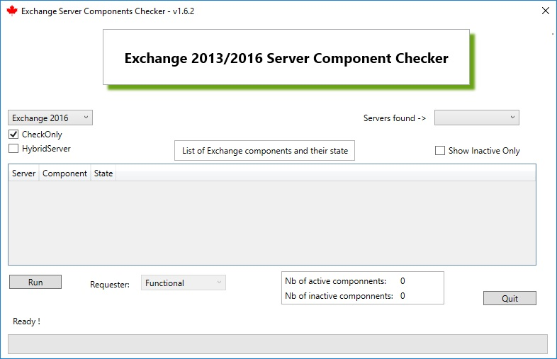
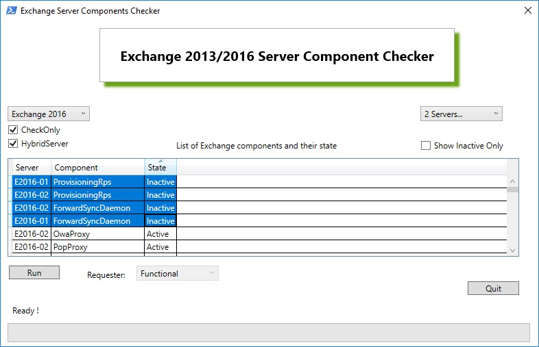
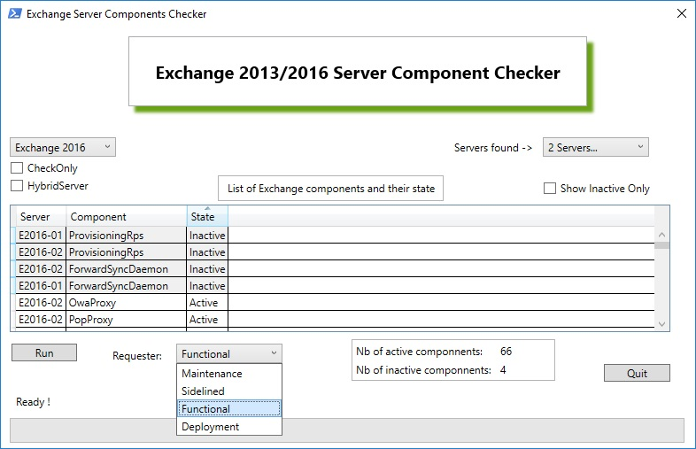

# Exchange Server Components Checker

Here’s the latest addition in Exchange 2013/2016 server quick tools. 
Sometimes, for maintenance or issues detected by Exchange Managed Availability, some components 
like Client Access, Autodiscover, Mail flow, etc... can be down on Exchange servers, which "exclude"
these servers from the pool of Exchange servers.
Here's a tool that helps you to check the state of every Exchange Server’s components and optionally start these if they are inactive.

These “Server Components” are new in Exchange 2013/2016, these are part of the Exchange Managed Availability features, and are there to ease server maintenance: inactive components are not targeted by the Client Access Services so that you can perform maintenance without having to affect the other Exchange services.

-	Choose your server version, Exchange 2013 or Exchange 2016, to check the components from
-	**[  ] CheckOnly** checkbox will just check and show each component from each of your organization’s servers: if checked, the tool will not attempt to start the inactive components
-	**[  ] HybridServer** checkbox will check two additional components that are used on Hybrid Exchange – O365 scenarios
-	**[  ] Show Inactive Only** : this checkbox will filter out all the Active components, so that you can check right away which servers and which components have Inactive services. You can check or uncheck it anytime, before or after the Server Components collection
-	Once you are happy with the chosen options, click the **[Run]** button to start gathering the information (at the bottom is the status bar along with a status label)

 

NOTE: once the components are gathered and show up, you can select all (click on one of the result cell, then CTRL+ a followed by CTRL + v) and paste it in a report, in Excel:
 

And finally, you're able to start the Exchange Server Components with the requester of your choice (Maintenance, SideLine, Functional, Deployment,...) - just uncheck the **[ ] CheckOnly** check box, choose your requester, and click **[Run]**

More information on these Server Components:
https://blogs.technet.microsoft.com/exchange/2013/09/26/server-component-states-in-exchange-2013/
